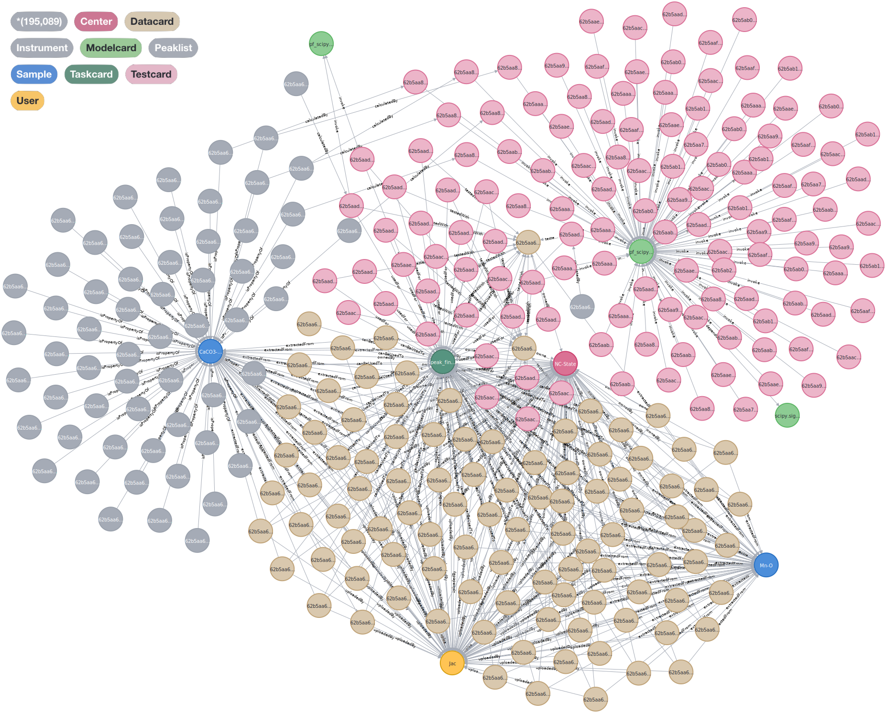
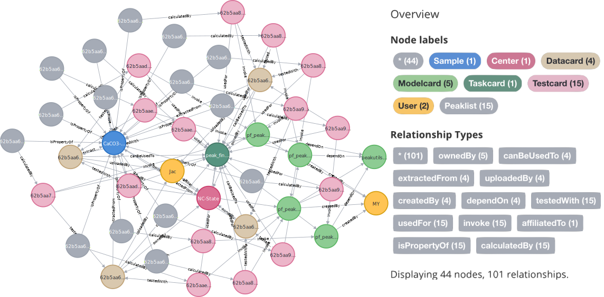

# CRUX

Demo Link: https://CRUX.hcma.repl.co

## CRUX-Onto

The Factual Knowledge layer is merged with [Materials Design Ontology](https://github.com/LiUSemWeb/Materials-Design-Ontology). Visualized by [OWLGrEd](http://owlgred.lumii.lv/online_visualization/1ahe).

## CRUX-KB (Fraction)

Visualized by Neo4J.

## Query Example

**Query:**
 
> "Find the ***datasets*** for sample **'CaCO3-TiO2'** provided by **'NC-State'**, a ***task*** with the name **'peak_finding'**, and the ***models*** implemented with the library **'peakutils'**."

**Visualized Result (fraction):**

## Acknowledgments

These resources are contributed by a group of CRUX community of 4 collaborative institutions: NASA, NC-State, UIUC and UNSW. CRUX community also includes International Centre for Diffraction Data (ICDD) and JADE database (with active users from 53 countries). ››