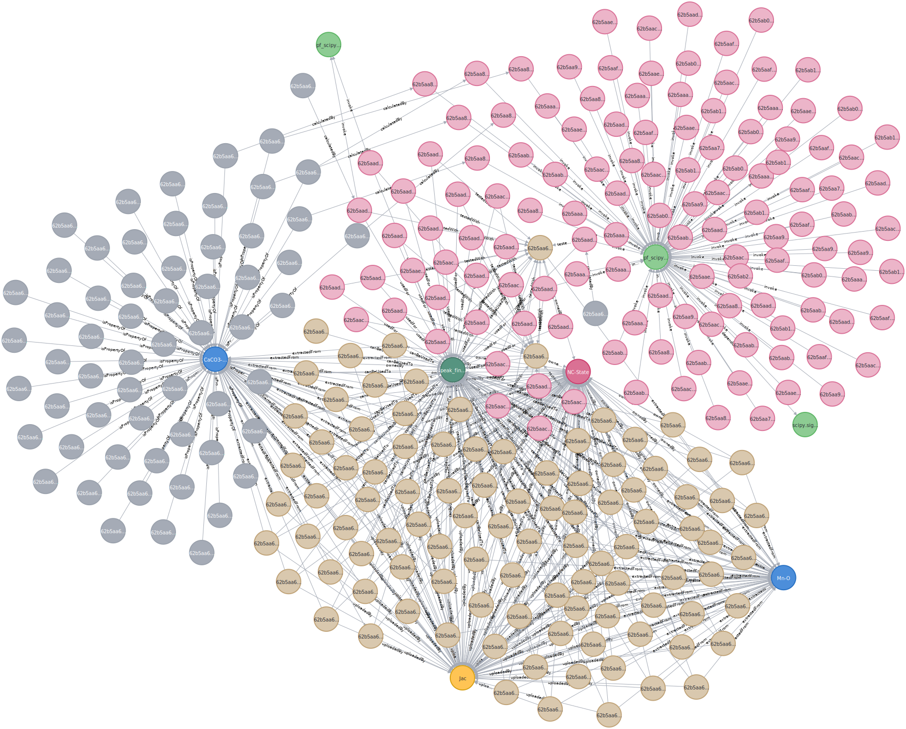

# CRUX

## CRUX-Onto

The Factual Knowledge layer is merged with [Materials Design Ontology](https://github.com/LiUSemWeb/Materials-Design-Ontology). Visualized by [OWLGrEd](http://owlgred.lumii.lv/online_visualization/1ahe).

## CRUX-KB (Fraction)

Visualized by Neo4J.